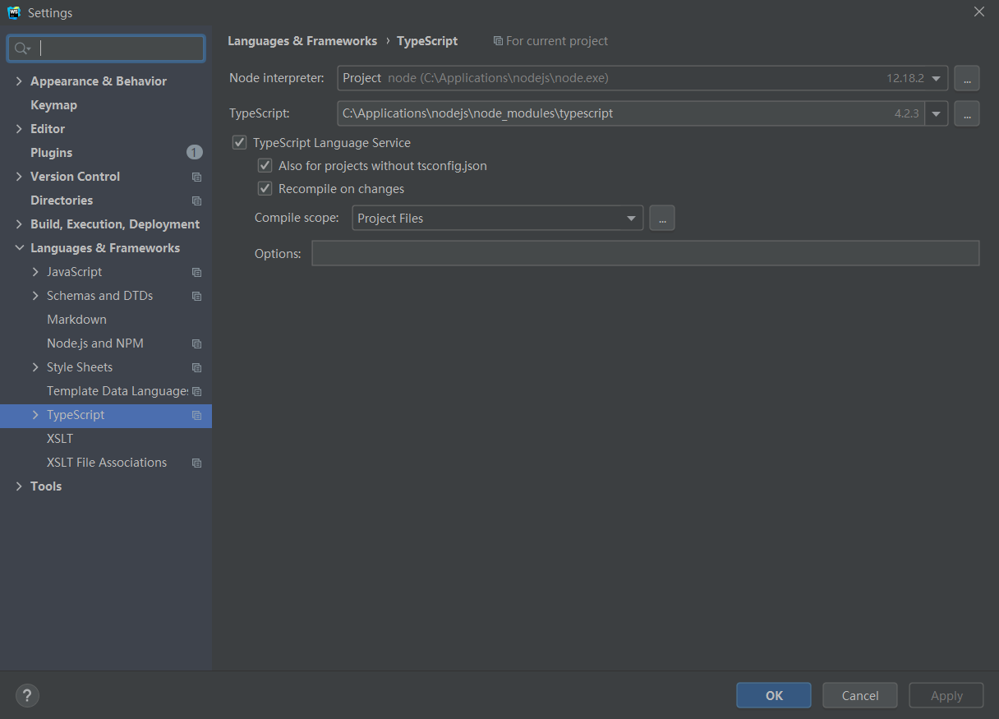
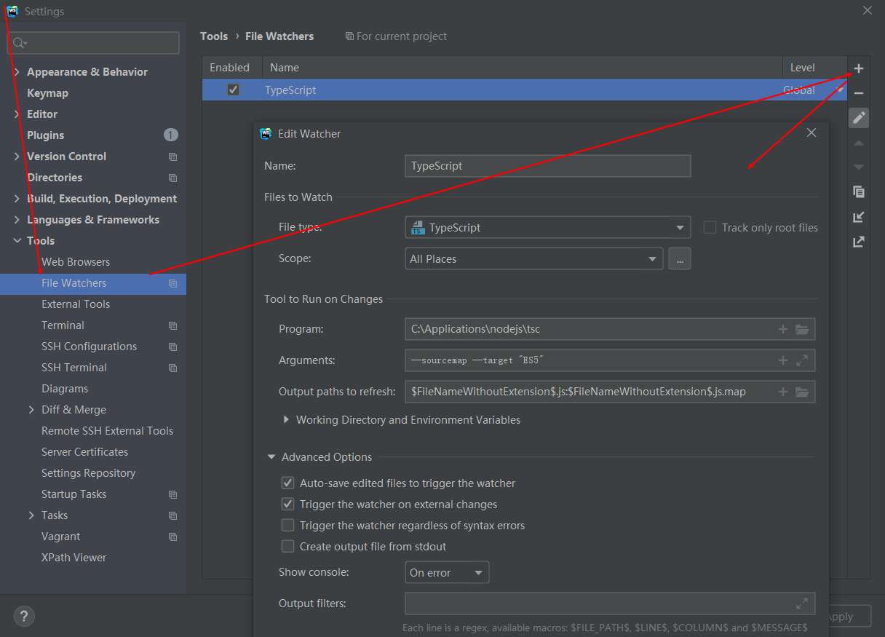
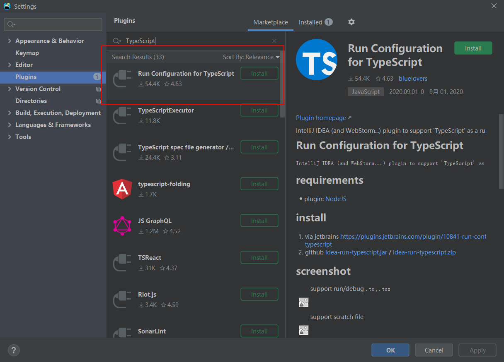

# TypeScript实战

[返回列表](https://github.com/EmonCodingFrontEnd/frontend-tutorial)

[toc]

# 一、环境配置

TypeScript官网地址：  https://www.typescriptlang.org/

## 1.1、安装TypeScript

通过`npm`来安装：

```sh
npm install -g typescript
```

使用tsc全局命令：

```bash
# 查看 tsc 版本
tsc -v 或者 tsc --version
# 编译 ts 文件

tsc fileName.ts
```


## 1.2、配置到WebStorm

1. 配置TypeScript

`Settings`->`Languages&Frameworks`->`TypeScript`，在右侧选择：TypeScript，指定到安装目录。




2. 在WebStorm中添加监听文件

`File`->`Settings`->`File Watchers`->`TypeScript`，这里选择`TypeScript`，但是File Watchers下默认是不存在的。添加如下图：



**注意**：`Program:`这一项一定要指定到`tsc.cmd`，如果是nvm安装的node，TypeScript是npm全局安装的，则`tsc.cmd`的位置类似上图。

```typescript
--sourcemap --target "ES5"
$FileNameWithoutExtension$.js:$FileNameWithoutExtension$.js.map
```


2. 自动执行TypeScript

- WebScorm安装直接运行所需依赖包

```bash
npm install -g ts-node
```

- 安装IDE插件

