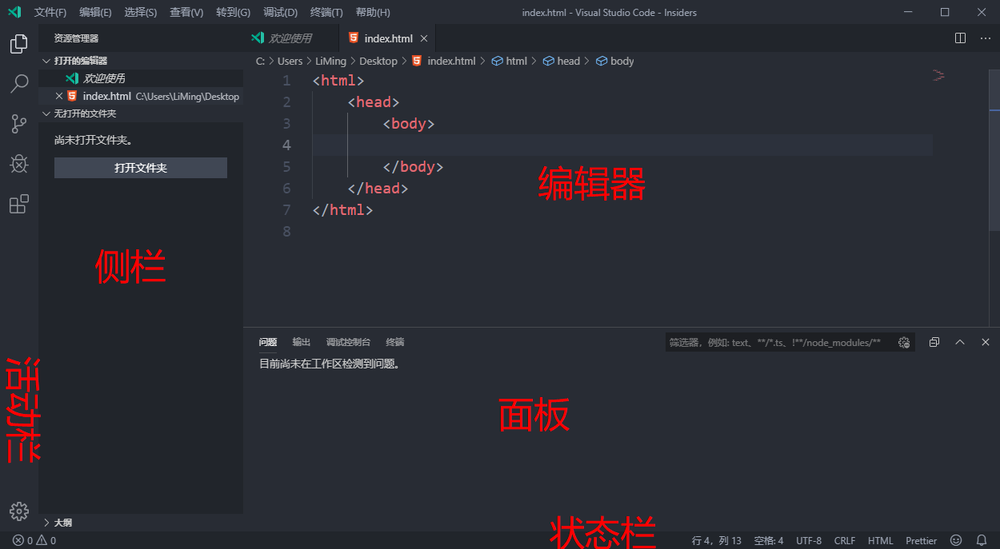
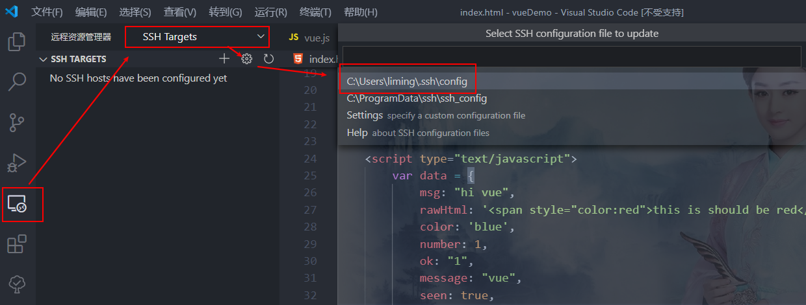

# VSCode使用详解

[返回列表](https://github.com/EmonCodingFrontEnd/frontend-tutorial)

[TOC]

# 一、下载安装

在`Build 2015`大会上，微软除了发布`Microsoft Edge`浏览器和新的`Windows 10`系统外，最大的惊喜莫过于宣布推出免费夸平台的`Visual Studio Code`编辑器了！

Visual Studio Code（简称VS Code/VSC）是一款免费开源的现代化轻量级代码编辑器，支持几乎所有主流的开发语言的语法高亮、智能代码补全、自定义快捷键、括号匹配和颜色区分、代码片段、代码对比Diff、GIT命令等特性，支持插件扩展，并针对网页和云端应用开发做了优化。软件跨平台支持Win、Mac以及Linux，运行流畅，可谓是微软的良心之作......

## 1.1、下载

Visual Studio Code官方下载地址： https://code.visualstudio.com/

## 1.2、安装

双击安装

# 二、偏好设置

## 2.1、用户界面




## 2.2、主题设置

【文件】->【首选项】->【颜色主题】（Ctrl+K Ctrl+T）

安装`One Dark Pro`颜色主题；安装`vscode-icons`图标主题；

## 2.3、用户和工作区

`用户设置`-全局应用于您打开的任何VS代码实例的设置；

`工作区设置`-存储在工作区内的设置，仅在打开工作区时应用；

【文件】->【首选项】->【设置】（Ctrl+,）

### 2.3.1、用户设置

1. 自动保存

`常用设置`->`Files:Auto Save`，选择`afterDelay`，延迟1秒保存。

2. Tab尺寸（一个Tab键，等于多少空格）

`常用设置`->`Editor:Tab Size`，使用默认的`4`。

3. 折行方式

`常用设置`->`Editor:Word Wrap`，选择`on`。

## 2.4、配置GIT

第一步：添加环境变量Path，追加Git路径，比如：`D:\Applications\Git\cmd`

第二步：重启VSCode

第三步：找到`用户设置`->`扩展`->`Git`->`Path`，选择在`settings.json`中编辑，增加如下：

```json
"git.path": "D:\\Applications\\Git\\cmd\\git.exe"
```

# 三、项目管理

## 3.1、VUE项目


## 3.2、Python项目


# 四、插件安装

## 4.1、CSS Peek

- 功能描述：html与css关联

## 4.2、Prettier

- 功能描述：代码格式化

## 4.3、Icon Fonts

- 功能描述：图标引入

## 4.4、Auto Rename Tag

- 功能描述：修改html标签时，会自动修改匹配的标签

## 4.5、HTML Boilerplate

- 功能描述：H5模板

## 4.6、Color Info

- 功能描述：颜色提示

## 4.7、Auto Close Tag

- 功能描述：自动闭合HTML/XML标签

## 4.8、HTML CSS Support

- 功能描述：智能提示CSS类名以及id

## 4.9、ESLint

## 4.10、Bracket Pair Colorizer

- 功能描述：给括号加上不同的颜色，便于区分不同的区块，使用者可以定义不同括号类型和不同颜色

## 4.11、Debugger for Chrome

- 功能描述：映射VSCode上的断点到chrome上，方便调试

## 4.12、GitLens

- 功能描述：方便查看git日志，git重度使用者必备

## 4.13、HTML Snippets

- 功能描述：智能提示HTML标签，以及标签含义

## 4.14、JavaScript(ES6) code snippets

- 功能描述：ES6语法智能提示，以及快速输入，不仅仅支持js，还支持.ts，.jsx，.jsx，.html, .vue，省去了配置其支持各种包含js代码文件的时间。

## 4.15、open in browser

- 功能描述：VSCode不像IDE一样能够直接在浏览器中打开html，而该插件支持快捷键与鼠标右键快速在浏览器中打开html文件，支持自定义打开指定的浏览器，包括：Firefox,Chrome,Opera,IE以及Shfari。

## 4.16、Path Intellisense

- 功能描述：自动提示文件路径，支持各种快速引入文件。

## 4.17、Vetur

- 功能描述：Vue多功能集成插件，包括：语法高亮，智能提示，emmet，错误提示，格式化，自动补全，debugger。vscode官方钦定Vue插件，Vue开发者必备。

### 4.17.1、VueHelper

- 功能描述：VueHelper提供.vue格式支持，以及语法高亮和补全

## 4.18、Npm Intellisense

- 功能描述：require时包提示

## 4.19、React/Redux/react-router Snippets

- 功能描述：React/Redux/react-router语法智能提示

## 4.20、Auto Import - ES6,TS,JSX,TSX

- 功能描述：Typescript 自动import提示

## 4.21、Live Server

- 功能描述：网页代码实时预览

## 4.22、Todo Tree

- 功能描述：对代码中添加的关键字TODO、FIXME生成直观的TODO结构，方便项目后期维护和更迭

## 4.23、 TODO Highlight

- TODO和FIXME的语法高亮

## 4.24、background

- 功能描述：背景设置
- 配置方式：【首选项】->【设置】->【扩展】->【Plugin background】，打开`settings.json`配置如下

```json
    "background.customImages": [
        "C:/Job/JobResource/IdeaProjects/139-1604251II9.jpg"
    ],
    "background.style": {
        "content": "''",
        "pointer-events": "none",
        "position": "absolute",
        "z-index": "99999",
        "width": "100%",
        "height": "100%",
        "background-position": "100% 100%",
        "background-repeat": "no-repeat",
        "opacity": 0.15,
        "background-size":"cover"
    },
    "background.useDefault": false
```

## 4.25、Remote Development

- 功能描述：远程开发工具
- 配置方式：如下图所示，打开`config`



在打开的`config`文件中，编辑`Host`、`HostName`、`User`：

```
# Read more about SSH config files: https://linux.die.net/man/5/ssh_config
Host house-new
    HostName 192.168.0.116
    User emon
```


# 五、快捷键

【重点】快捷键映射，可以将其他编辑器的快捷键应用到VSCode上。 

【文件】->【首选项】->【按键映射】（Ctrl+K Ctrl+M）

【重点】自定义快捷键

【文件】->【首选项】->【键盘快捷方式】（Ctrl+K Ctrl+S）

【重点】万能快捷键

Ctrl+Shift+P：打开命令面板

## 5.1、编辑

| 快捷键              | 功能描述                     |
| ------------------- | ---------------------------- |
| Ctrl+C              | 复制选中；复制一行           |
| Ctrl+V              | 粘贴                         |
| Ctrl+S              | 保存                         |
| Ctrl+X              | 剪切选中；剪切一行           |
| Ctrl+/              | 行注释                       |
| Alt+Shift+A         | 块注释                       |
| Ctrl+Shift+Enter    | 上方插入一行                 |
| Ctrl+Enter          | 下方插入一行                 |
| Alt+Shift+F         | 格式化代码                   |
| Alt+Shift+Up        | 向上复制行                   |
| Alt+Shift+Down      | 向下复制行                   |
| Alt+Shift+C         | 文件：复制活动文件的路径     |
| Ctrl+K Ctrl+Shift+C | 文件：复制活动文件的相对路径 |
| Alt+Up              | 向上移动行                   |
| Alt+Down            | 向下移动行                   |
| Alt+Shift+F5        | 移动到上一个更改             |
| Alt+F5              | 移动到下一个更改             |
| Ctrl+K Ctrl+\       | 视图：正交拆分编辑器         |
| Ctrl+Shift+5        | Terminal：垂直拆分终端       |
| F11                 | 全屏/退出全屏                |
| Ctrl+-/+            | 放大或者缩小编辑器           |
| Ctrl+Shift+K        | 删除一整行                   |

## 5.2、查找/替换

| 快捷键       | 功能描述   |
| ------------ | ---------- |
| Ctrl+F       | 查找       |
| Ctrl+Shift+F | 文件夹查找 |
| Ctrl+H       | 替换       |
|              |            |

## 5.3、引用查询

## 5.4、编译和运行

## 5.5、调试

## 5.6、导航

## 5.7、重构

## 5.8、版本控制/本地历史

## 5.9、动态模板

## 5.10、通用

## 5.11、插件

## 5.12、自定义

| 快捷键 | 功能描述                                                     |
| ------ | ------------------------------------------------------------ |
| Alt+H  | 视图：水平拆分；可在键盘快捷方式搜索“向下拆分”设置           |
| Alt+U  | 视图：合并所有编辑器组；可在键盘快捷方式搜索”合并所有编辑器组“设置 |
|        |                                                              |


## 5.13、原生快捷键更改记录

| 原快捷键   | 新快捷键 | 更改原因                     |
| ---------- | -------- | ---------------------------- |
| Ctrl+\     | Alt+V    | 不够便捷，没有配对的水平拆分 |
| Ctrl+Space | Alt+J    | 被输入法占用                 |
|            |          |                              |
|            |          |                              |


## 5.14、根据释义查询快捷键

【文件】->【首选项】->【键盘快捷方式】（Ctrl+K Ctrl+S），然后输入快捷键组合（比如ctrl+f)或者释义即可。

# 六、常用技巧


# 七、其他


