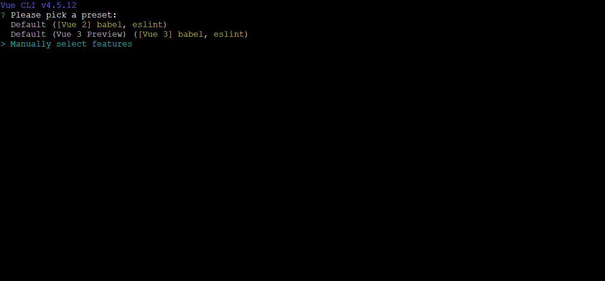
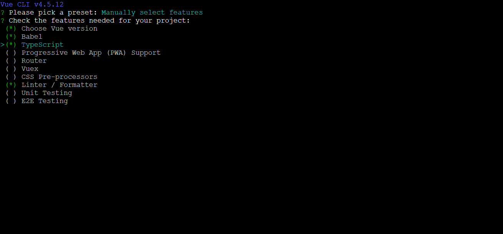
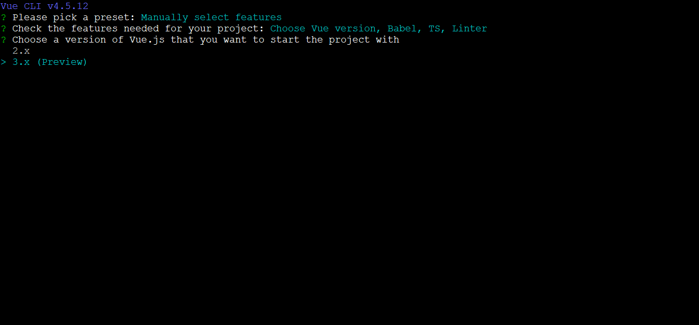
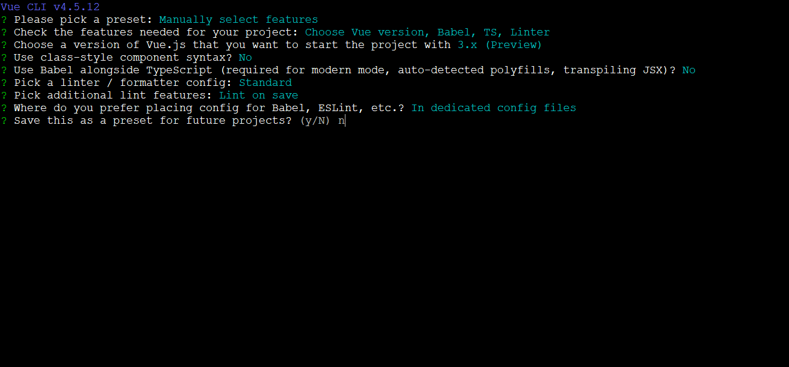
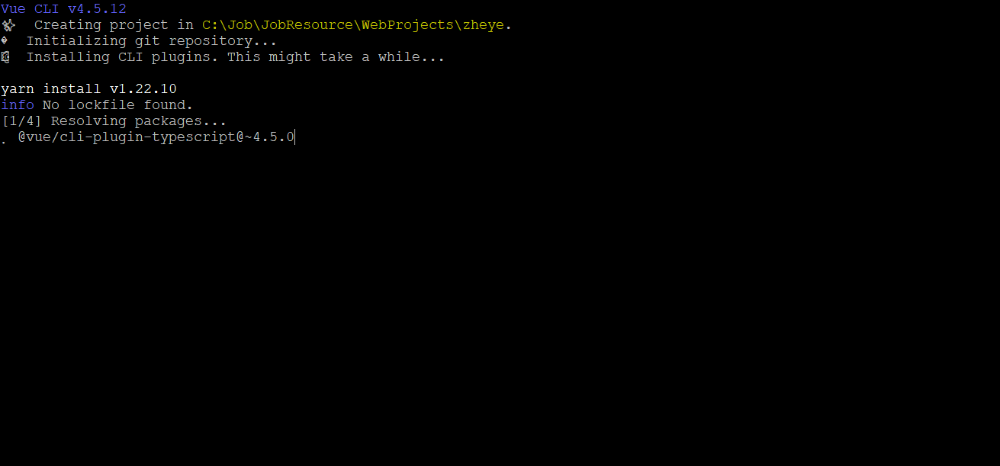
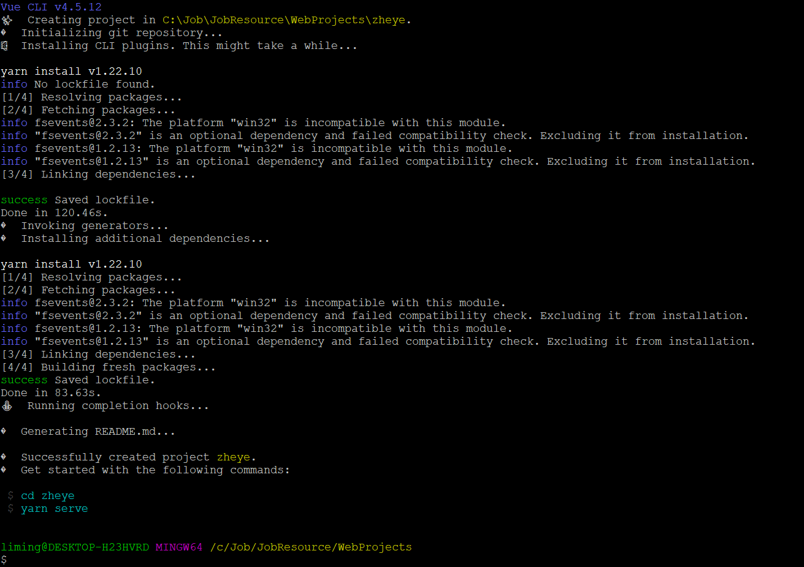
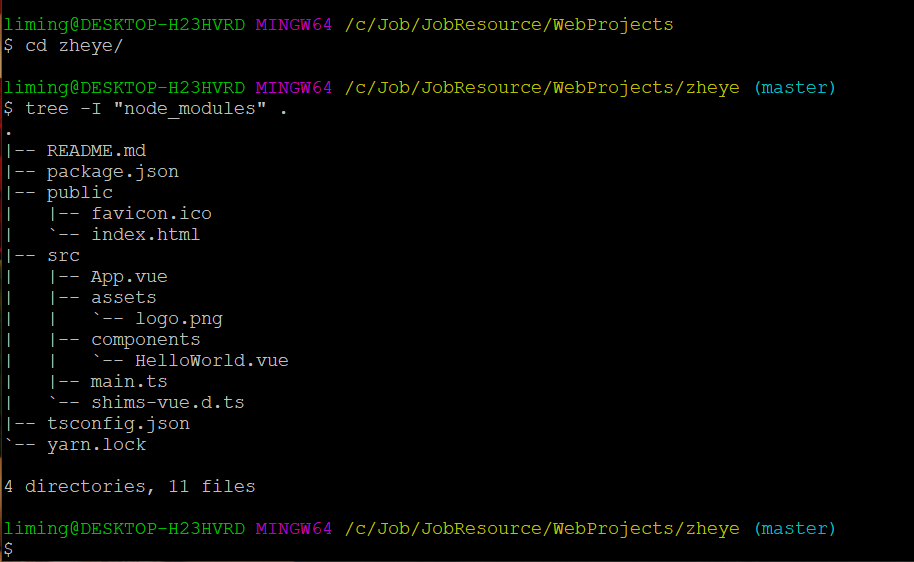

# Vue实战

[返回列表](https://github.com/EmonCodingFrontEnd/frontend-tutorial)

[TOC]

# 一、基本环境准备

## 1、WebStorm配置

https://www.jianshu.com/p/165db5bb1392

https://blog.csdn.net/coding_lin/article/details/81093890

https://www.jianshu.com/p/ad8c3b480ef3

## 2、安装谷歌访问助手

https://github.com/zcjunblog/google-access-helper2021


# 二、vue-cli

## 1、安装Vue Cli 5.x

- 前提：

Node.js ^12.0.0 || >= 14.0.0

- 安装：

```shell
$ npm i -g @vue/cli
```

- 升级

如需升级全局的Vue Cli包，请原型。

```shell
$ npm update -g @vue/cli
```

- 创建项目

```shell
$ vue create vue_test
```

- 启动项目

```shell
$ cd vue_test
$ npm run serve
```

## 2、小贴士

- 地址栏中，经常出现#，是什么作用，能不能去掉#？
- hash模式：地址栏包含#符号，#以后的不被后台获取
- history模式：具有对url历史记录进行修改的功能
- 在微信支付、分享url作为参数传递时，#不能满足需求
- history需要后台配置，处理404的问题。


## 3、Nuxt

官网：https://zh.nuxtjs.org/

### 3.1、基本安装

- 创建并安装依赖

```bash
npx create-nuxt-app <项目名>【推荐】
或
yarn create nuxt-app <项目名> 
```


- 安装依赖

如果创建过程发生某一个依赖的版本错误，可以如下再次安装。

```bash
cd <项目名> && npm install --update-binary 【推荐】重新编译下
或
cd <项目名> && yarn install
```

- 开发环境运行

```bash
# 以开发模式（热加载）启动KoaJS server在开发环境，监听 http://localhost:3000
cd <项目名> && npm run dev
或
yarn run dev
```

- 生产环境

```bash
# 编译生产环境的nuxt.js应用
cd <项目名> && npm run build
# 在生产环境启动
npm run start
---------
或
---------
yarn run build
yarn start
```


备注：不要用github的`.gitignore`覆盖命令生成的。

### 3.2、安装配置babel

注：引入`babel`可以使用`import`

1. 安装babel

```bash
# 在项目的根目录下
npm install babel-core babel-preset-es2015 babel-cli
```

2. 添加`.babelrc`

在项目的根目录下，添加`babelrc`

```json
{
    "presets": ["es2015"]
}
```

3. 修改`package.json`

添加`--exec babel-node`，注意是2处，dev和start都需要，如下：

```json
  "scripts": {
    "dev": "cross-env NODE_ENV=development nodemon server/index.js --watch server --exec babel-node",
    "build": "nuxt build",
    "start": "cross-env NODE_ENV=production node server/index.js --exec babel-node",
    "generate": "nuxt generate",
    "lint": "eslint --ext .js,.vue --ignore-path .gitignore ."
  }
```

### 3.3、引入scss

1. 安装

```bash
npm install sass-loader node-sass
```

安装时发现失败，如下：


在admin模式下，全局安装windows构建工具即可！

```bash
npm install --global --production windows-build-toold
```


## 4、基于`Vue CLI v4.5.12`创建包含`TypeScript`的项目

- 第一步

```bash
vue create zheye
```

- 第二步



- 第三步



- 第四部



- 第五步



- 第六步



- 等待很久，完成！



- 目录结构




## Vue2和Vue3声明周期对比

```bash
// mapping vue2 to vue3
beforeCreate -> use setup()
created -> use setup()
beforeMount -> onBeforeMount
mounted -> onMounted
beforeUpdate -> onBeforeUpdate
updated -> onUpdated
beforeDestroy -> onBeforeUnmount
destroyed -> onUnmounted
activated -> onActivated
deactivated -> onDeactivated
errorCaptured -> onErrorCaptured

// added
onRenderTracked
onRenderTriggered
```


# 九、常见问题

## 1、git bash 使用 vue-cli 创建项目无法切换选项

配置`~/.bashrc`：

```bash
alias vue='winpty vue.cmd'
```

