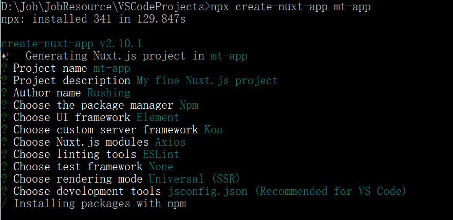
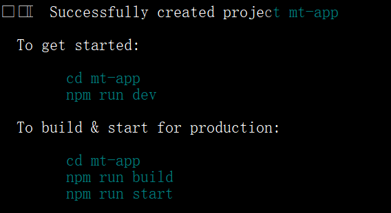
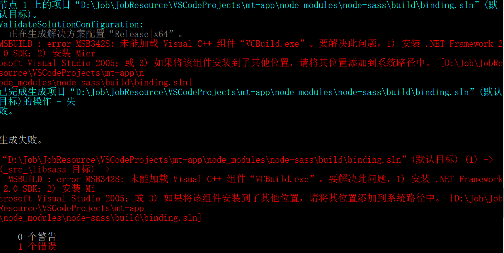

# Vue实战

[返回列表](https://github.com/EmonCodingFrontEnd/frontend-tutorial)

[TOC]

# 一、基本环境准备

## 1、WebStorm配置

https://www.jianshu.com/p/165db5bb1392

https://blog.csdn.net/coding_lin/article/details/81093890

https://www.jianshu.com/p/ad8c3b480ef3

### 1.1、注册参考

获取注册码的原始引导地址：https://www.jianshu.com/p/133af2e4fe3f

- 注册码：

```
http://idea.lanyus.com/
```

### 1.2、配置Node

左侧： `Default Settings`->`Languages&Frameworks`->`Node.js and NPM`

右侧：

-  `Node interpreter`: 选择 node.exe 存在的路径，比如：

```
C:\Program Files\nodejs\node.exe
```

- 勾选`Coding assistance for Node.js`
- `Package manager`: 选择包含npm的路径，比如：

```
C:\Program Files\node_modules\npm
```

### 1.3、调试

## 2、安装谷歌访问助手

https://github.com/haotian-wang/google-access-helper

## 3、安装vue-devtools

https://segmentfault.com/a/1190000015363628

## 4、安装nvm

## 5、安装配置node环境


# 二、vue-cli

## 1、vue-cli2

### 1.1、安装

```bash
npm install -g vue-cli
```

- 查看

```bash
vue -V
```


### 1.2、创建vue-cli2项目

```bash
vue init webpack <projectName>
```

安装过程需要注意的点：

- Install vue-router?(Y/n)是否安装vue-router，这是官方的路由，大多数情况下都使用，这里就输入“y”后回车即可。
- Use ESLint to lint your code?(Y/n)是否使用ESLint管理代码，ESLint是个代码风格管理工具，是用来统一代码风格的，一般项目中都会使用。

安装完成后，根据提示启动项目：

```bash
cd <projectName>
npm run dev
```


### 1.3、小贴士

- 地址栏中，经常出现#，是什么作用，能不能去掉#？
- hash模式：地址栏包含#符号，#以后的不被后台获取
- history模式：具有对url历史记录进行修改的功能
- 在微信支付、分享url作为参数传递时，#不能满足需求
- history需要后台配置，处理404的问题。


## 2、vue-cli3

### 1.1、卸载vue-cli2

```bash
npm uni vue-cli -g
```

### 1.2、安装

```bash
npm install -g @vue/cli
```

- 查看

```bash
vue -V
```

- 启动图形界面

```bash
vue ui
```

### 1.3、创建vue-cli3项目

```bash
vue create <projectName>
```

安装完成后，根据提示启动项目：

```bash
cd <projectName>
npm run serve
或
yarn serve
```

### 1.4、安装@vue/cli-init

```bash
npm i -g @vue/cli-init
或
yarn global add @vue/cli-init
```

## 3、Nuxt

官网：https://zh.nuxtjs.org/

### 3.1、基本安装

- 创建并安装依赖

```bash
npx create-nuxt-app <项目名>【推荐】
或
yarn create nuxt-app <项目名> 
```



- 安装依赖

如果创建过程发生某一个依赖的版本错误，可以如下再次安装。

```bash
cd <项目名> && npm install --update-binary 【推荐】重新编译下
或
cd <项目名> && yarn install
```

- 开发环境运行

```bash
# 以开发模式（热加载）启动KoaJS server在开发环境，监听 http://localhost:3000
cd <项目名> && npm run dev
或
yarn run dev
```

- 生产环境

```bash
# 编译生产环境的nuxt.js应用
cd <项目名> && npm run build
# 在生产环境启动
npm run start
---------
或
---------
yarn run build
yarn start
```




备注：不要用github的`.gitignore`覆盖命令生成的。

### 3.2、安装配置babel

注：引入`babel`可以使用`import`

1. 安装babel

```bash
# 在项目的根目录下
npm install babel-core babel-preset-es2015 babel-cli
```

2. 添加`.babelrc`

在项目的根目录下，添加`babelrc`

```json
{
    "presets": ["es2015"]
}
```

3. 修改`package.json`

添加`--exec babel-node`，注意是2处，dev和start都需要，如下：

```json
  "scripts": {
    "dev": "cross-env NODE_ENV=development nodemon server/index.js --watch server --exec babel-node",
    "build": "nuxt build",
    "start": "cross-env NODE_ENV=production node server/index.js --exec babel-node",
    "generate": "nuxt generate",
    "lint": "eslint --ext .js,.vue --ignore-path .gitignore ."
  }
```

### 3.3、引入scss

1. 安装

```bash
npm install sass-loader node-sass
```

安装时发现失败，如下：



在admin模式下，全局安装windows构建工具即可！

```bash
npm install --global --production windows-build-toold
```


# 三、常用包安装

## 1、axios

一个基于promise的http库，可以用在浏览器和node.js中。

```bash
npm i axios -S
```

## 2、webpack

```bash
npm install -g webpack
```


# 九、常见问题

## 1、git bash 使用 vue-cli 创建项目无法切换选项

配置`~/.bashrc`：

```bash
alias vue='winpty vue.cmd'
```

